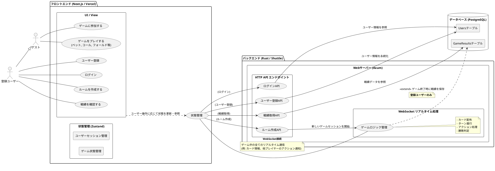

```plantuml
@startuml
left to right direction

' === アクター定義 ===
actor Guest as "ゲスト"
actor User as "登録ユーザー"

' ゲストと登録ユーザーの関係（登録ユーザーはゲストのできることは全てできる）
User --|> Guest

' === フロントエンド (Next.js) ===
package "フロントエンド (Next.js / Vercel)" {
    rectangle "UI / View" {
        usecase "ゲームに参加する" as JoinGame
        usecase "ゲームをプレイする\n(ベット, コール, フォールド等)" as PlayGame

        Guest -- JoinGame
        Guest -- PlayGame

        usecase "ユーザー登録" as Register
        usecase "ログイン" as Login
        usecase "ルームを作成する" as CreateRoom
        usecase "戦績を確認する" as ViewHistory

        User -- Register
        User -- Login
        User -- CreateRoom
        User -- ViewHistory
    }

    rectangle "状態管理 (Zustand)" {
        rectangle "ユーザーセッション管理" as UserSession
        rectangle "ゲーム状態管理" as GameState
    }

    (UI / View) ..> (状態管理) : ユーザー操作に応じて状態を更新・参照
}

' === バックエンド (Rust / Shuttle) ===
package "バックエンド (Rust / Shuttle)" {
    rectangle "Webサーバー (Axum)" {
        rectangle "HTTP API エンドポイント" {
            usecase "ユーザー登録API" as RegisterAPI
            usecase "ログインAPI" as LoginAPI
            usecase "ルーム作成API" as CreateRoomAPI
            usecase "戦績取得API" as HistoryAPI
        }

        rectangle "WebSocket リアルタイム処理" {
            usecase "ゲームロジック管理" as GameLogic
            note right of GameLogic
                - カード配布
                - ターン進行
                - アクション処理
                - 勝敗判定
            end note
        }
    }
}

' === データベース (PostgreSQL / Shuttle) ===
database "データベース (PostgreSQL)" {
    rectangle "Usersテーブル" as UsersTable
    rectangle "GameResultsテーブル" as ResultsTable
}

' === データフロー ===
(状態管理) --> RegisterAPI : (ユーザー登録)
(状態管理) --> LoginAPI : (ログイン)
(状態管理) --> CreateRoomAPI : (ルーム作成)
(状態管理) --> HistoryAPI : (戦績取得)

RegisterAPI --> UsersTable : ユーザー情報を永続化
LoginAPI --> UsersTable : ユーザー情報を参照
CreateRoomAPI --> GameLogic : 新しいゲームセッションを開始
HistoryAPI --> ResultsTable : 戦績データを参照

' WebSocketの接続
(状態管理) -- GameLogic : <size:12><b>WebSocket接続</b>
note on link
  ゲーム中の全てのリアルタイム通信
  (例: カード情報、他プレイヤーのアクション通知)
end note

GameLogic ..> ResultsTable : <<extend>> ゲーム終了時に戦績を保存
note on link
  <b>登録ユーザーのみ</b>
end note

@enduml
```